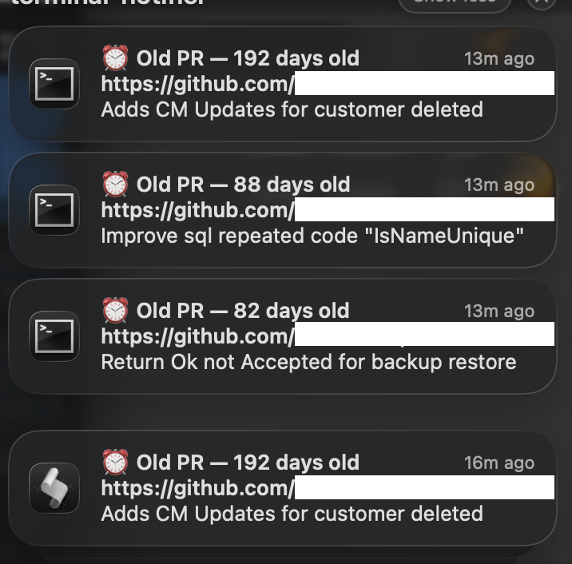

# Pull Request Manager

A collection of scripts to help manage and stay on top of your GitHub pull requests.

---

## Old PR Notifications

Runs once a day and sends a macOS notification for every open PR you authored that is older than **7 days**. Clicking a notification opens the PR in your browser.

### Screenshot



### What it does

1. Uses the GitHub CLI (`gh`) to search for all open PRs authored by you across all repositories.
2. Calculates the age of each PR.
3. Sends a clickable macOS notification for any PR older than 7 days, showing the PR title and URL.
4. Logs all output (notified and skipped PRs) to `~/Library/Logs/check-old-prs.log`.

### Packages used (note - The install script will do this automatically)

| Package | Purpose | Install |
|---|---|---|
| [`gh`](https://cli.github.com/) | GitHub CLI — fetches your open PRs | `brew install gh` |
| [`terminal-notifier`](https://github.com/julienXX/terminal-notifier) | Sends clickable macOS notifications | `brew install terminal-notifier` |
| `python3` | Parses JSON and calculates PR age | Pre-installed on macOS |

### Installation

1. Clone this repository:
   ```bash
   git clone <repo-url>
   cd pull-request-manager
   ```

2. Run the install script:
   ```bash
   sh install.sh
   ```

   The installer will:
   - Install any missing packages (`gh`, `terminal-notifier`) via Homebrew
   - Prompt you to authenticate with GitHub if not already logged in
   - Ask what time you'd like the daily check to run (e.g. `09:00`)
   - Register a macOS LaunchAgent to run the script automatically at that time

3. To run it immediately:
   ```bash
   sh check-old-prs.sh
   ```

### Uninstall

```bash
launchctl unload ~/Library/LaunchAgents/com.harveytaylor.check-old-prs.plist
rm ~/Library/LaunchAgents/com.harveytaylor.check-old-prs.plist
```
